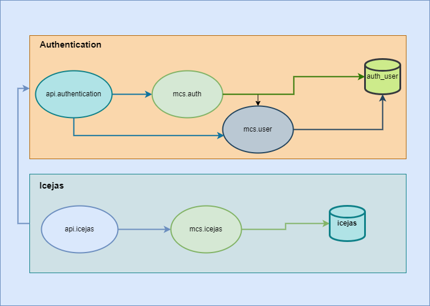

# mcs.icejas
Microservicio que maneja el flujo de ingresos y egresos del iglesias ICEJAS

# Tecnologias utilizadas
Lenguaje: ```Java```

Framework: ```Spring```

Base datos: ```PostgreSql```

Seguridad:  ```Posee su API la cual valia el API KEY y ACCESS TOKEN```

Docker: ```Docker file para crear imagen ```

Documentacion:```Swagger-ui para documentar los enpoint ```


# Flujo con los mcs y apis relacionados


# Levantar el proyecto localmente
1- Clonar el proyecto
```git clone https://github.com/jbarrios5/mcs.icejas.git```

2- Clonar tambien el proyecto ```jmbr.commons``` que es utilizado para las clases comunes.
```git clone https://github.com/jbarrios5/jmbr.commons.git```

3- Ejcutar el comando ```mvn clean install``` en ambos proyectos para descargar las dependencias

4- Tener configurado una base de datos ```postgres``` y adaptar la cadena de conexion del archivo ```application.yml``` del proyecto ```mcs.auth```

5- Ejecutar el comando ```java -jar mcs.auth.jar```